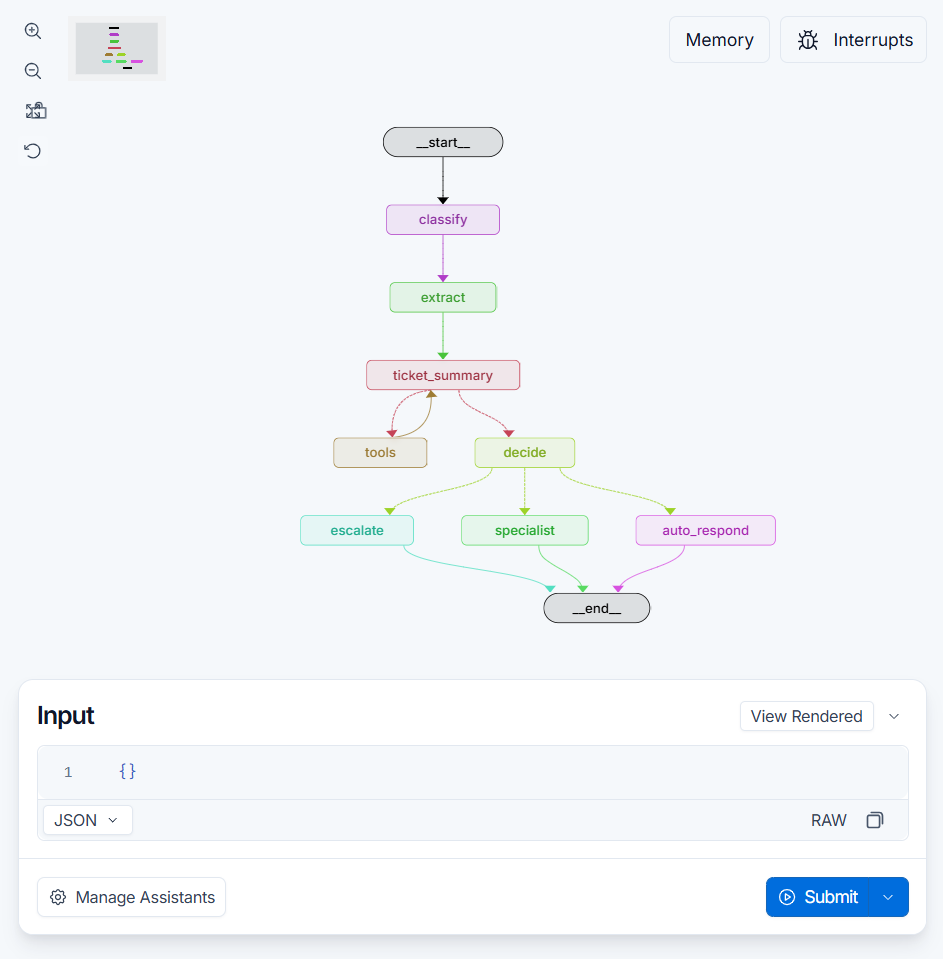

# Support Ticket Triage Agent

## Requirements

- Python 3.13 or newer
- [uv](https://docs.astral.sh/uv/)
- An LLM API key: OpenAI or OpenRouter
- *(Optional)* LangSmith API key, to visualize tce runs

## Setup

```bash
uv sync
cp .env.example .env 
```

Fill in `.env`:

| Variable | Notes |
|---|---|
| `OPENAI_API_KEY` or `OPENROUTER_API_KEY` | Set one only |
| `OPENROUTER_BASE_URL` | Only for OpenRouter |
| `MODEL_NAME` | OpenAI: `gpt-6-luna`. OpenRoute: `openai/gpt-6-luna` |
| `LANGSMITH_API_KEY`, `LANGSMITH_ENDPOINT`, `LANGSMITH_PROJECT` | Optional. For Studio and tracing |

## Run

### Command line

```bash
uv run python -m src.cli
uv run python -m src.cli path/to/tickets.json   # runs your own file
```

### Visualize in LangGraph Studio

```bash
uv run langgraph dev
```



Open the Studio URL printed in the terminal and paste a ticket as the input:

```json
{
  "ticket": {
    "ticket_id": "T-001",
    "customer_id": "C-001",
    "messages": [
      {
        "sent_at": "3 hours ago",
        "content": "My payment failed when I tried to upgrade to Pro. Can you check what's wrong?"
      },
      {
        "sent_at": "just now",
        "content": "I have THREE charges of $29.99 and still no Pro access. I will dispute them."
      }
    ]
  }
}
```

Studio shows each node as it runs, with its input, output, and the state after each step.

## Notes

- Mock tickets, customers and knowledge base articles live in `data/`.
- `customer_id` must exist in `data/customer_information.json`.
- Restart `uv run langgraph dev` after editing `.env`.